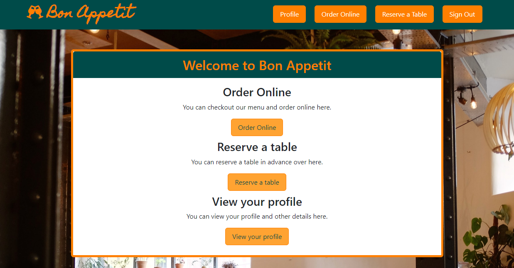

# Bon Appetit Restaurant Reservation

## Table of contents

- [Overview](#overview)
  - [The challenge](#the-challenge)
  - [User Story](#user-story)
  - [Acceptance Criteria](#acceptance-criteria)
  - [Screenshot](#screenshot)
  - [Links](#links)
- [Our process](#my-process)
  - [Built with](#built-with)  
  - [Continued development](#continued-development)  
- [Authors](#authors)
- [Acknowledgments](#acknowledgments)


## Overview

### The challenge

Create a Full stack RESTFUL application that utilizes Node.js and Express.js for the backend. It uses mySQL for database and Sequelize as the ORM. It is deployed through Heroku. The Application uses Passport.js for user authentication. This is a Restaurant application where the supported functionalities are Sign up, Login, Reserve a table, Order online and view Profile.

### User Story

```
AS a Restaurant Customer
I WANT an online Reservation/Order system, 
SO THAT I can make a reservation or order online and view the activity on my profile
```

### Acceptance Criteria

```
Use Node.js and Express.js to create a RESTful API
use Handlebars.js as the template engine
Use MySQL and the Sequelize ORM for the database
Has GET and POST routes for retrieving and adding new data
Folder structure that meets the MVC paradigm
Includes authentication (express-session and cookies) 
Protects API keys and sensitive information with environment variables
Deploy using Heroku (with data)
Has a polished UI
```

### Screenshot




### Links

- Solution URL: [https://github.com/anuvytla/bon-appetit](https://github.com/anuvytla/bon-appetit)
- Live Site URL: [https://reservation-bonappetit.herokuapp.com/signup](https://reservation-bonappetit.herokuapp.com/signup)

## Our process

### Built with

- javaScript
- CSS
- Semantic HTML5 markup
- Node.js

### Dependencies
- bcrypt
- connect-session-sequelize
- connect-sqlite3
- cookie-parser
- dotenv
- Express.js
- express-handlebars
- express-sesssion
- inquirer
- mysql2
- passport
- sequelize


```javaScript
const router = require('express').Router();
const apiRoutes = require('./apiRoutes');

router.use('/api', apiRoutes);

module.exports = router;
```


### Continued development

- Upscale application to handle reservations and online orders for multiple restaurants

- Incorporate a Seating Chart

- Provide statistical reporting

- Add payment gateway

- Option to modify or cancel reservation/order

- Expand to add more restaurants
 


## Authors

- Professional Portfolio - [Anusha Vytla](https://www.your-site.com)
- Github - [anuvytla](https://github.com/anuvytla)
-------------------------------------------------------------

- Professional Portfolio - [Devi Nallammai](https://rmdn321.github.io/homework-2/)
- Github - [rmdn321](https://github.com/rmdn321/)
--------------------------------------------------------------

- Professional Portfolio - [Robert M Greene](https://monkonjay.github.io/Portfolio/)
- Github - [Monkonjay](https://github.com/Monkonjay)
--------------------------------------------------------------


## Acknowledgments

We owe gratitude to one another, the surviving members of this team, for the grit and tenacity exhibited to meet the project deliverables within the deadline. We started as a 5-member team and lost 2 members at the very beginning of the project. We pulled together, encouraged each other, and sacrificed additional hours in order to fulfill the project requirements. That’s TEAMWORK at its best!  
